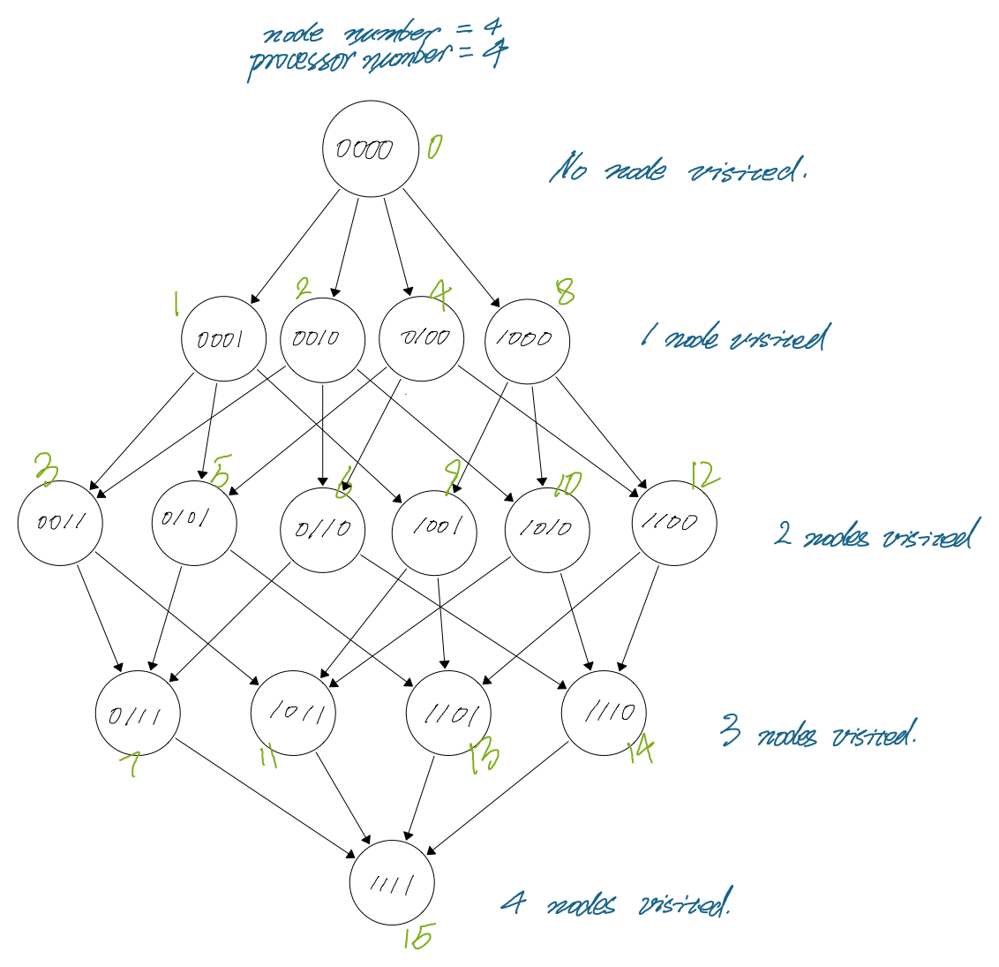

# Parallel Travelling Salesman Problem using MPI (Message Passing Interface)

## 1. Overview

In this repo, I had developed a **pipeline** implementation for the **Dynamic Programming** solution of **Travelling Salesman Problem**. Which show performance 2 times faster than the serial version in terms of timing runs. 

## 2. Serial Solution

Reconstructed from [this Leetcode post](https://leetcode.com/discuss/general-discussion/1125779) by [DBabichev](https://leetcode.com/DBabichev) which solves the problem of [Find the Shortest Superstring](https://leetcode.com/problems/find-the-shortest-superstring/). Under the hood, it's actuall a Travelling Salesman Problem. 

**Time Complexity**:

The implementation is identical to the Java solution provided in the assignment by [williamfiset](https://github.com/williamfiset/algorithms). The overall Time Complexity is `O(n^2 * 2^n)`:

Assuming the number of nodes are `n`. 

We first initialize a 2-D matrix `dp[state][node]` representing the minimal cost/path visiting all nodes from bit mask `state` and last visited node `node`. 

Then we construct the `dp` row by row starting from `dp[0]` to `dp[(1 << n) - 1]`. Inside of each row `current_mask`, we will construct it by reusing all the previous row `state_dest_not_visited` which with Hamming Distance of 1 comparing to `current_mask`. 

At last, we will return `dp[(1 << n) - 1][0]` which mean all nodes have been visited and last visited node is `0`, i.e, visiting all `n` nodes and back to the starting node.

Hence, the time complexity, to construct the `dp` matrix, is number of possible bit mask by number of permutation of any 2 nodes, i.e.,  `O(n^2 * 2^n)`.

## 3. Multi-Threaded Solution

Reconstructed from [the iterative version](tsp/tsp_serial_iterative.py). Instead of solving the `dp` matrix row by row, we put each row's processing to a  `helper` function in a thread pool created by `ThreadPoolExecutor` with thread count of `p` = `min(os.cpu_count(), len(weights))`. Inside of each thread, it will call `helper` function which update the `dp` matrix in the share memory for each row.

**Time Complexity**:

Instead of processing each row in sequential, we solve a `p` number of sub-problems in parallel. Updating the `dp` matrix is happening in shared memory, hence no extra communication overhead needed. Hence the overall Time Complexity is `O(n^2 * 2^n / p)`, when `p == 2^n`, the time complexity becomes `O(2^n)`

## 4. MPI Pipeline Design

### Overview

In this setup, I first let the rank 0 processor do a OneToAll broadcast of the weight matrix with size of n2. 

Doing this will need:

$$T_{OneToAllBroadcast} = (T_{s} + T_{m} * n ^ 2) * \log p$$

Then, the rank 0 processor will generate the initial task with time:

$$T_{InitialTaskGeneration} = n$$

After that, all the processors will start working on solving the sub problem of the whole DP table as shown below.

We can separate the DP table into layers, each layer representing number of nodes have been visited and among them having task dependency:

The 1st layer representing no node has been visited and needed by the 2nd layer

The 2nd represeniting all masks with 1 node been visited and needed by the 3rd layer

The 3rd layer represeniting all masks with 2 nodes been visited and needed by the 4th layer

...

For each iteration, all processors will work on one layer simultaneously.

For each bit mask being handled, Let's assume the mask having `b` 1 bit in the bit mask,the processor will do the following 3 tasks:

1. PointToPoint Recv  `b` number of dependent tasks with size `n` from above layer
2. Calculate the optimal path. For each un-visited node, find the optimal path from visited nodes. Time will be n2
3. PointToPoint Send `n - b` number of optimal path with size `n` to the corresponding below layers' processors.

All together, the time need to process one bit mask:

$$T_{Bit Mask} = n * (T_{s} + T_{m} * n) + n^2$$

### Processor Load Balancing

Assuming our number of processor `p` is the power of 2, i.e.: 2, 4, 8, 16... 

I find the folling mapping rule will give a better load balancing across all processor:

`(mask + 1) // 2 % p`

For example, for a 4 nodes 4 processors mapping:

| Decimal Mask | MapProcessor | Bit Mask |
| ------------ | ------------ | -------- |
| 0            | 0            | 0000     |
|              |              |          |
| 2            | 1            | 0010     |
| 4            | 2            | 0100     |
| 8            | 0            | 1000     |
|              |              |          |
| 6            | 3            | 0110     |
| 10           | 1            | 1010     |
| 12           | 2            | 1100     |
|              |              |          |
| 14           | 3            | 1110     |
|              |              |          |
| 15           | 0            | 1111     |

Each processor will handle equal number of mask:

| Processor Rank | Task Count |
| -------------- | ---------- |
| 0              | 2          |
| 1              | 2          |
| 2              | 2          |
| 3              | 2          |

Similarly for a 5 nodes 4 processors mapping:

| Decimal Mask | MapProcessor | Bit Mask |
| ------------ | ------------ | -------- |
| 0            | 0            | 00000    |
|              |              |          |
| 2            | 1            | 00010    |
| 4            | 2            | 00100    |
| 8            | 0            | 01000    |
| 16           | 0            | 10000    |
|              |              |          |
| 6            | 3            | 00110    |
| 10           | 1            | 01010    |
| 12           | 2            | 01100    |
| 18           | 1            | 10010    |
| 20           | 2            | 10100    |
| 24           | 0            | 11000    |
|              |              |          |
| 14           | 3            | 01110    |
| 22           | 3            | 10110    |
| 26           | 1            | 11010    |
| 28           | 2            | 11100    |
|              |              |          |
| 30           | 3            | 11110    |
|              |              |          |
| 31           | 0            | 11111    |

| Processor Rank | Task Count |
| -------------- | ---------- |
| 0              | 4          |
| 1              | 4          |
| 2              | 4          |
| 3              | 4          |

## 5. Performance Analysis

1. Time complexity

	Below table is a preview of the overall time complexity:

	|                              | Large Number of Processor | Small Number of Processor                         |
	| ---------------------------- | ------------------------- | ------------------------------------------------- |
	| $$T_{\text{Computing TSP}}$$ | $$O(n^3) $$               | $${n ^ 2 \cdot 2 ^ {n - 1} \over p} $$            |
	| $$T_{p}$$                    | $$O(n ^ 3) $$             | $${n ^ 2 \cdot 2 ^ {n} \over p} + n^2\log p + n$$ |

	

	As we can see from the above task dependency graph figure, the middle layer requires the most computation and processors $$N_{Processor} = {n - 1 \choose {n \over 2}}$$. 

	

	**Case 1:  $$p \geq N_{Processor}$$**

	If we have number of processor $$p \geq N_{Processor}$$, the number of processor is large enough to handle each layer in one step concurrently, i.e:

	$$ N_{\text{Step}} = 1 $$ 

	Then the time complexity will be:

	 $$ T_{\text{Computing TSP}} = T_{Bit Mask} * N_{Step} * Layer = n^2(T_{s} + T_{m}n) + n^3 = O(n^3) $$

	

	 $$ T_{\text{p}} = T_{\text{Computing TSP}} + T_{OneToAllBroadcast} + T_{InitialTaskGeneration} $$

	 $$  = n^3 + n^2\log p + n = O(n^3)$$

	

	

	**Case 2:  $$p < N_{Processor}$$**

	For the case that p is lesser, which is most possibly the case as we can seen from the table below.

	The processors needed will grow near exponentially. It's imposisble to have this many number of processors:

	| Number of Node | Mask count of the middle layer |
	| -------------- | ------------------------------ |
	| 10             | 126                            |
	| 11             | 252                            |
	| 12             | 462                            |
	| 13             | 924                            |
	| 14             | 1,716                          |
	| 15             | 3,432                          |
	| 16             | 6,435                          |
	| 17             | 12,870                         |
	| 18             | 24,310                         |
	| 19             | 48,620                         |
	| 20             | 92,378                         |
	| 21             | 184,756                        |
	| 22             | 352,716                        |

	If we assume each layer will have the average identical number of masks, i.e., 

	

	 $$N_{Average} = {N_{Total Number Of Mask Of All Layers} \over N_{Number Of Layer}} = {2 ^ {n} \ \over n}$$

	

	Then each layer will need NStep iterations to finish computing all masks:

	 $$ N_{\text{Step}} = {N_{Average} \over p} =  {2^{n} \over np} $$

	 

	Then for this case the overall time needed will be :

	 $$ T_{\text{Computing TSP}} = T_{Bit Mask} * N_{Step} * Layer = (n (T_{s} + T_{m} * n) + n^2) * {2^{n} \over np} * n  = {n ^ 2 \cdot 2 ^ {n} \over p} $$

	 $$ T_{\text{p}} = T_{\text{Computing TSP}} + T_{OneToAllBroadcast} + T_{InitialTaskGeneration} $$

	 $$  = {n ^ 2 \cdot 2 ^ {n} \over p} + n^2\log p + n$$

1. Speedup S = TS / TP

	**Case 1:  $$p \geq N_{Processor}$$**

	 $$Speedup = {T_{s} \over T_{p}} = {2 ^ n n ^ 2 \over n ^ 3} = {2 ^ n \over n}$$

	

	**Case 2:  $$p < N_{Processor}$$**

	 $$Speedup = {T_{s} \over T_{p}} = {n ^ 2 2 ^ n \over {{n ^ 2 2 ^ {n} \over p} + n^2\log p + n}}  = {n ^ 2 2 ^ n \over {{n ^ 2 2 ^ {n} \over p}}} = p$$

	

2. Efficiency E = TS/ pTP

	**Case 1:  $$p \geq N_{Processor}$$**

	 $$E = {Speedup \over p} = {2 ^ n \over np}$$

	

	**Case 2:  $$p < N_{Processor}$$**

	 $$E = {Speedup \over p} = 1$$

	

3. Cost = pTP

	

	**Case 1:  $$p \geq N_{Processor}$$**

	$$pT_{p} = p * n ^ 3$$

	

	**Case 2:  $$p < N_{Processor}$$**

	$$pT_{p}= p * ({{n ^ 2 2 ^ {n - 1}} \over p}) = n ^ 2 2 ^ {n - 1}$$

4. Scalability (Isoefficiency)

	T0 = pTP - TS 

	W = TS = KT0 = f(p)

	

	**Case 1:  $$p \geq N_{Processor}$$**

	$$T_{0} = pT_{p} - T_{s} = p * (n ^ 3)- n ^ 2 2 ^ n$$

	$$W = T_{s} = KT_{0}$$

	==> $$n^2 2 ^ n = K*n^2(np - 2 ^ n)$$

	==> $$p = 2 ^ {n + 1}$$

	==> $$ n = \log p $$

	==> $$ W = T_{s} = 2 ^ {\log p} * {\log p} ^ 2$$

	

	**Case 2:  $$p < N_{Processor}$$**

	$$T_{0} = pT_{p} - T_{s} = p * ({{n ^ 2 2 ^ {n}} \over p} + n^2 \log p + n)  - n ^2 2 ^ n = n^2 \log p$$

	$$W = T_{s} = KT_{0}$$

	==> $$n^2 2 ^ n = K*n^2 \log p + n$$

	==> $$n^2 2 ^ n = K*n^2 \log p$$

	==> $$ n = \log \log p = O(\log p) $$

	==> $$ W = T_{s} = p * (\log p) ^ 2$$ 

## 6. Results and Conclusions

| n    | Serial  | Threaded | Thread Count | MPI       | processors |
| ---- | ------- | -------- | ------------ | --------- | ---------- |
| 3    | 0.0001  | 0.0032   | 8            | 0.0006051 | 4          |
| 4    | 0.0001  | 0.0058   | 16           | 0.0002539 | 4          |
| 5    | 0.0001  | 0.0060   | 32           | 0.0018542 | 4          |
| 6    | 0.0004  | 0.0125   | 64           | 0.0010192 | 4          |
| 7    | 0.0011  | 0.0178   | 128          | 0.0020041 | 4          |
| 8    | 0.0029  | 0.0305   | 256          | 0.0028729 | 4          |
| 9    | 0.0073  | 0.0595   | 512          | 0.0068841 | 4          |
| 10   | 0.0162  | 0.1145   | 1,024        | 0.01508   | 4          |
| 11   | 0.0368  | 0.2437   | 2,048        | 0.0292201 | 4          |
| 12   | 0.0905  | 0.4797   | 4,096        | 0.0774343 | 4          |
| 13   | 0.2176  | 1.0923   | 8,192        | 0.1446242 | 4          |
| 14   | 0.4929  | 2.6333   | 16,384       | 0.2970612 | 4          |
| 15   | 1.1630  | 7.5699   | 32,768       | 0.6614022 | 4          |
| 16   | 2.6974  | 19.1027  | 65,536       | 1.4253139 | 4          |
| 17   | 6.2469  | 40.4822  | 131,072      | 3.1328492 | 4          |
| 18   | 14.6932 | 99.9603  | 262,144      | 7.094985  | 4          |
| 19   | 31.0961 | 216.1901 | 524,288      | 17.413076 | 4          |
| 20   | 85.9556 | 495.3688 | 1,048,576    | 39.290877 | 4          |